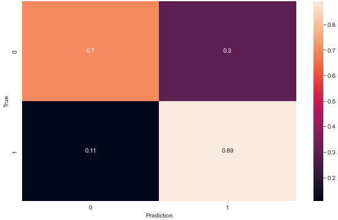
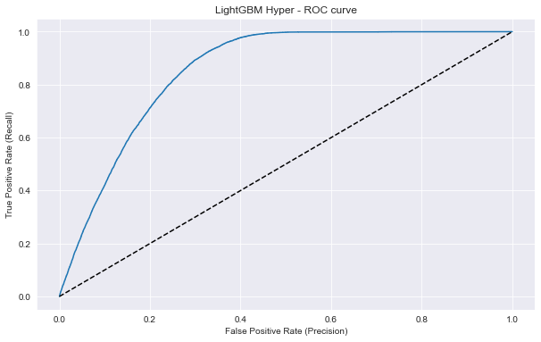
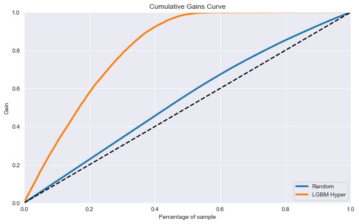

# Health Insurance Cross Sell
Welcome to my portifolio. The current project tackle on a classification problem of making a [cross sell](https://www.investopedia.com/terms/c/cross-sell.asp) of a car insurance policy to our health insurance clients.

## 1. Business Proposition
___
The [Dataset](https://www.kaggle.com/datasets/anmolkumar/health-insurance-cross-sell-prediction) corresponds of a insurance company located in India. Said company provides health insurance to its customers, now they want help to in predicting potential clients interest in acquiring a car insurance policy. Building a Machine Learning model to predict whether a customer would be interested in vehicle insurance, is  helper to archive this goal.
Creating this model was the work of this project.

#### Assumptions
In order to have a coherent project, some assumptions had to be made about the company:
- The channel of communication with the customers is by phone calls
- The company wants to minimize the number of phone calls
- The current method to reach potential clients is to randomly call them
- Our model, proven to be more efficient, will replace the random model

## 2. Data Understanding
---
The dataset has 381,109 rows (customers) and 12 columns (customers characteristics), as displayed in the following table:

|Attribute|Definition|Data Type|
|---|---|---|
|id|Unique ID for the customer|int64|
|gender|Gender of the customer|object|
|age|Age of the customer|int64|
|driving_license|0 : Customer does not have DL, 1 : Customer already has DL|int64|
|region_code|Unique code for the region of the customer|float64|
|previously_insured|1 : Customer already has Vehicle Insurance, 0 : Customer doesn't have Vehicle Insurance|int64|
|vehicle_age|Age of the Vehicle|object|
|vehicle_damage|1 : Customer got his/her vehicle damaged in the past. 0 : Customer didn't get his/her vehicle damaged in the past|object|
|annual_premium|The amount customer needs to pay as premium in the year|float64|
|policy_sales_channel|Anonymised Code for the channel of outreaching to the customer ie. Different Agents, Over Mail, Over Phone, In Person, etc|float64|
|vintage|Number of Days, Customer has been associated with the company|int64|
|response|1 : Customer is interested, 0 : Customer is not interested|int64|

## 3. Plan of Action
---
The [CRIPS-DM](https://www.ibm.com/docs/en/spss-modeler/saas?topic=dm-crisp-help-overview) methodology was applied to trace my plan of action.
Here's the process, step by step:

1. **Business Understanding:** The insurance company wants a model to predict the potential customers for their new car insurance policy.
2. **Data Understanding:** To build the model, a dataset, with relevant information about our customers, was provided.
3. **Data Preparation:** Data preparation allows for efficient data analysis, limits errors and inaccuracies that can occur during data processing, and makes all processed data more accessible to users. 80% of the database was utilized to train the models and 20% to evaluate how effective the models are.
4. **Exploratory Data Analysis:** EDA is helpful to investigate the data and summarize the key insights. It will give me the basic understanding of the data, it's distribution, null values and much more. I used both graphs and python functions to extract insights.
5. **Feature Selection:** Feature Selection is the method of choosing relevant features for the machine learning model. For this purpose, Boruta and extra trees classifier were utilized.
6. **Machine Learning Modeling:** I build 6 machine learning classification models in order to find the best solution to the business proposition. To ensure that our models are good generalization tools, cross validation was utilized, as well as hyperparameters tuning. Models built: Logistic regression, random forest classifier, XGBoost, LightGBM, KNN and decision tree classifier.
7. **Evaluation:** Evaluation metrics are useful for determining the best machine learning model, out of the 6 previously built. The succeeding metrics were used to evaluate the models: Accuracy (both train and test datasets), confusion matrix, precision, recall, F1-score, ROC curve, AUC and cumulative gain curve.     

## 4. Extracted Insights
***
1. 60.91% of the Interested customers are male, 39.09% are female
2. Younger people ( under 35 ) are less likely to be interest in car insurance
3. Customers without a driver's license aren't interested in car insurance
4. The 5 regions more densely populated, are 60.89% of our customers
5. Policyholders that already have car insurance, aren't keen to get our car insurance
6. The older the car, more keen the customer becomes to acquire our car insurance
7. If the customer has been in an accident, they are more likely to accept our car insurance
8. The amount our customers pay in their annual premium does not affect their interest in purchasing our car insurance policy
9. 72.18% of Interested customers were reached through 3 channels: 26, 124 and 152
10. The number of days that the customer is affiliated with our company, has no correlation with the interest in our car insurance policy

## 5. Machine Learning Models and Evaluation Metrics
***
As previously stated, 6 classification machine learning models were built to make the prediction about interested clients.
 These are their metrics, sorted by "F1-score 1":

|Model Name|Accuracy|Precision 1|Recall 1|F1-Score 1|Precision 0|Recall 0|F1-Score 0|
|---|---|---|---|---|---|---|---|
|LightGBM |70.19% +/- 0.316% |0.28 +/- 0.005 |0.93 +/- 0.005 |0.43 +/- 0.005 |0.99 +/- 0.005 |0.67 +/- 0.003 |0.8 +/- 0.004 |
|Logistic Regression |63.81% +/- 0.169% |0.25 +/- 0.005 |0.98 +/- 0.003 |0.4 +/- 0.006 |0.99 +/- 0.004 |0.59 +/- 0.0 |0.74 +/- 0.0 |
|Decision Tree Classifier |82.36% +/- 0.192% |0.29 +/- 0.01 |0.31 +/- 0.005 |0.3 +/- 0.006 |0.9 +/- 0.0 |0.9 +/- 0.005 |0.9 +/- 0.0 |
|KNN ( k=5 ) |85.49% +/- 0.13% |0.32 +/- 0.007 |0.16 +/- 0.005 |0.22 +/- 0.006 |0.89 +/- 0.0 |0.95 +/- 0.0 |0.92 +/- 0.0 |
|Random Forest Classifier |86.45% +/- 0.159% |0.35 +/- 0.008 |0.12 +/- 0.005 |0.18 +/- 0.005 |0.89 +/- 0.0 |0.97 +/- 0.0 |0.93 +/- 0.003 |
|XGBoost |87.18% +/- 0.131% |0.38 +/- 0.021 |0.07 +/- 0.005 |0.12 +/- 0.006 |0.88 +/- 0.003 |0.98 +/- 0.003 |0.93 +/- 0.0 |

The LightGBM model was the best performing model, hence the chosen model to solve our business problem. The [Optuna](https://optuna.org/) framework was utilized to tune the hyperparameters of the LightGBM model.
Bellow are it's metrics:

|Model Name|Accuracy|AUC|# True 1|# Predictions 1|Precision 1|Recall 1|F1-Score 1|# True 0|# Predictions 0|Precision 0|Recall 0|F1-Score 0|
|---|---|---|---|---|---|---|---|---|---|---|---|---|
|Hyper LightGBM|72.48%|0.85|9342|28297|0.29|0.89|0.44|66880|47925|0.98|0.70|0.82|

#### Confusion Matrix

 

#### ROC Curve

 

#### Cumulative Gains Curve

 

## 6. Business Results
***
The intent of this project is to determine the best percentage of calls that should be made, in order to maximize our profits and reduce our costs.
Our database comes from an Indian insurance company, so all the monetary values are on Rupees (₹). On the day I'm working on this project, ₹81.7=US$1.

Purchasing car insurance is mandatory in India. [The average price, for car insurance, from the top 10 car insurance plans](https://www.policybazaar.com/motor-insurance/car-insurance/articles/how-much-does-your-car-insurance-cost-per-month-in-india/) is about ₹2480 ( US$30.35 ). [This Forbes article](https://www.forbes.com/advisor/in/car-insurance/a-comprehensive-guide-to-motor-insurance/) gives more detail about car insurance in India.

I'll assume all the customers will be contancted by telephone. [The average cost per call](https://www.fcbco.com/articles-and-whitepapers/articles/bid/129578/managing-your-cost-per-call), on average, is ₹179.74 ( US$2.20 ) in the USA. [In India the average cost per call is lower](https://cloudtask.com/blog/how-much-does-it-cost-to-outsource-a-call-center); for this reason, many companies outsource their call centers to India. In this case, considering the previous source, I'll assume the average cost per call in India is half the US's, at ₹89.87 ( US$1.10 )

Finally:
- We have 76,222 potential clients ( test database )
- 9,342 are willing to buy our car insurance policy. This means ₹23,168,160.02 ( US$283,576.01 ) possible gains
- The cost of calling 100% of our customers is ₹6,850,071.14 ( US$83,844.20 )

#### Conclusion

The Hyperparamenter LightGBM model predicted there are 28,297 clients susceptible to buy our health insurance plan. Consequently, there is no reason to call 100% of our clients, but only those selected ones, which corresponds to 37% of our database. This will speed up the process and reduce company costs.

A comparison between the Hyper LGBM model and the company's previous random method of reaching customers, is shown in the table below.

|# of Calls|Model Profit (US$) |Random Profit (US$) | Diffecence (US$)|
|---|---|---|---|
|5000|39,121.79|7,447.07|31,674.72|
|10000|78,789.96|13,796.30|64,993.66|
|20000|156,729.99|26,474.73|130,255.26|
|28297|221,790.80|37,740.06|184.050.74|

As can be observed, the Hyper LGBM model outperformes randomly calling customers.

**Even if the company decided to call 100% of their customers (76,222), their maximum profit would be ₹16,318,088.88 ( US$199,731.81 ). ₹1,802,219.48 (US$22,058.99) lower than our model reaching 37% of the customer.**
