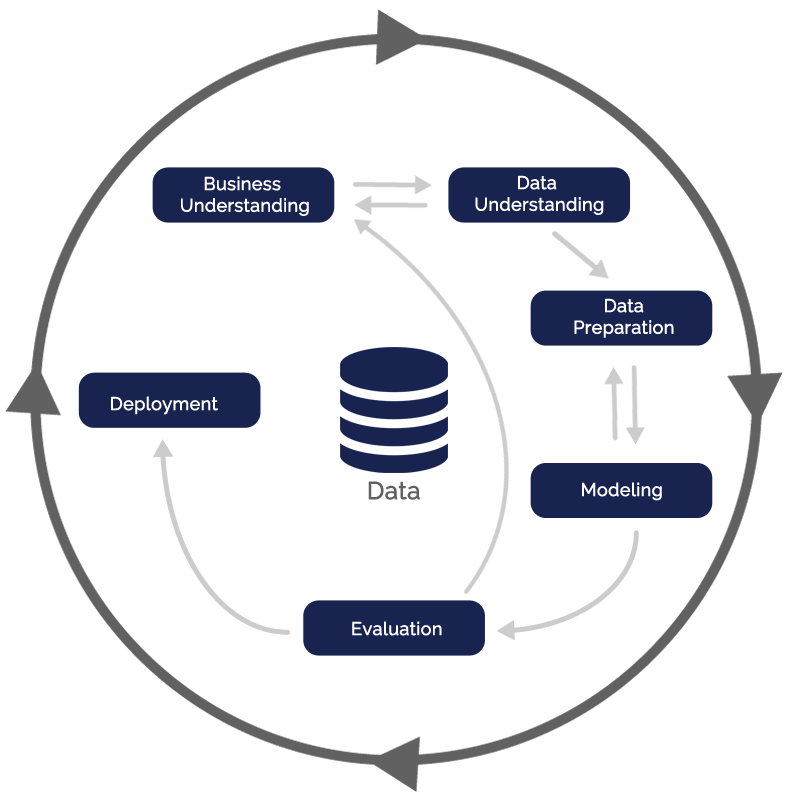

# Health Insurance Cross Sell
The current project tackles on a classification problem of [cross-selling](https://www.investopedia.com/terms/c/cross-sell.asp) car insurance policy to our health insurance clients.

## Table of Contents
- [1. Business Proposition](#1-business-proposition)
- [2. Data Understanding](#2-data-understanding)
- [3. Plan of Action](#3-plan-of-action)
- [4. Extracted Insights](#4-extracted-insights)
- [5. Machine Learning Models and Evaluation Metrics](#5-machine-learning-models-and-evaluation-metrics)
- [6. Business Results](#6-business-results)
- [7. Future Work](#7-future-work)

## 1. Business Proposition

The [Dataset](https://www.kaggle.com/datasets/anmolkumar/health-insurance-cross-sell-prediction) corresponds to an insurance company located in India. Said company provides health insurance to its customers, now they want help in predicting the interest of potential customers in purchasing car insurance.

The idea of this project is to use a machine-learning model to rank the customers who are more likely to be interested in buying auto insurance.

#### Assumptions
In order to have a coherent project, some assumptions had to be made about the company:
- The channel of communication with the customers is through phone calls
- The company wants to minimize the number of phone calls
- The current method to reach potential clients is to randomly call them
- Our model, proven to be more efficient, will replace the random model

## 2. Data Understanding

The dataset has 381,109 rows (customers) and 12 columns (customers characteristics). At first glance I'm able to notice the data is unbaceled. There are 381,109 unique customers, 334,399 and not interested (87,74%) in the new car insurance policy, while 46,710 are interested (12,26%).

The dataset columns is displayed in the following table:

|Attribute|Definition|Data Type|
|---|---|---|
|id|Unique ID for the customer|int64|
|gender|Gender of the customer|object|
|age|Age of the customer|int64|
|driving_license|0 : Customer does not have DL, 1 : Customer already has DL|int64|
|region_code|Unique code for the region of the customer|float64|
|previously_insured|1 : Customer already has Vehicle Insurance, 0 : Customer doesn't have Vehicle Insurance|int64|
|vehicle_age|Age of the Vehicle|object|
|vehicle_damage|1 : Customer got his/her vehicle damaged in the past. 0 : Customer didn't get his/her vehicle damaged in the past|object|
|annual_premium|The amount customer needs to pay as premium in the year|float64|
|policy_sales_channel|Anonymised Code for the channel of outreaching to the customer ie. Different Agents, Over Mail, Over Phone, In Person, etc|float64|
|vintage|Number of Days, Customer has been associated with the company|int64|
|response|1 : Customer is interested, 0 : Customer is not interested|int64|

## 3. Plan of Action

### 3.1. End Goal
The final product will be a website where you'll be able to select the number of phone calls that should be made, and display the comparison of the profit made by the machine learning model versus the random model. It'll also be capable of downloading the data as a CSV file.

### 3.2. Tools & Frameworks
The following is a list of the tools and frameworks that were used in this project:

- Python 3.9.12
- Jupyter Notebook
- Git & GitHub
- Kaggle
- Pandas
- Numpy
- Optuna Hyperparameter Tuning
- Streamlit
- Feature Selection Attributes (Boruta and Extra Trees Classifier)
- Machine Learning Classification Models
- Rander Dashboard Cloud

### 3.3. CRISP-DM Process
The [CRIPS-DM](https://www.ibm.com/docs/en/spss-modeler/saas?topic=dm-crisp-help-overview) methodology was applied to trace my plan of action.
Here's the process, step by step:

 

**Step 1. Business Understanding:**
- The insurance company wants a model to predict potential customers for their new car insurance policy
- Research on the average cost of car insurance in India, and the cost of operating a call center

**Step 2. Data Understanding:**
- The dataset was collect from Kaggle and imported to Jupyter Notebook
- Data studied to understand the meaning of each customer characteristics (columns), dimension and it's balance
- Our data is unbaceled, from 381,109 customers:
  - 334,399 (87,74%) are not interested
  - 46,710 (12,26%) are interested
- Therefore, data preparation techniques must be applied to avoid bias or overfitting in our model

**Step 3. Data Preparation:**
- Data preparation allows for: efficient data analysis, limits errors and inaccuracies that can occur, and makes all processed data more accessible to users
- 80% of the database was utilized to train the models, the remaining 20% to evaluate how effective the models were
- Standartization, scaling individual samples to have unit norm
- Rescaling, transformation of features by scaling each feature to a specified range
- Encoder, encoding categorial attributes into numerical attributes

**Step 4. Exploratory Data Analysis:**
- EDA is helpful to investigate the data and summarize the key insights
- It gives basic understanding of the data, it's distribution, null values and much more
- Graphs and python functions were used to extract key insights

**Step 5. Feature Selection:**
- Feature Selection is the method of choosing relevant features for the machine learning model
- A list is created with the estimated relevance of the attributes for learning the models
- For this purpose, Boruta and Extra Trees Classifier were utilized
- Selected attributes:
  1. `vintage`
  2. `annual_premium`
  3. `age`
  4. `region_code`
  5. `vehicle_damage`
  6. `policy_sales_channel`
  7. `previously_insured`

**Step 6. Machine Learning Modeling:**
- 6 machine learning classification models were built, in order to find the best solution to the business proposition
- Models built:
  1. Logistic Regression
  2. Random Forest Classifier
  3. XGBoost
  4. LightGBM
  5. KNN
  6. Decision Trees Classifier

**Step 7. Evaluation:**
- Evaluation metrics are useful for determining the best machine learning model, out of the 6 previously built
- The succeeding metrics were used to evaluate the models:
  1. Accuracy (both train and test datasets)
  2. Confusion Matrix
  3. Precision
  4. Recall
  5. F1-score
  6. ROC curve
  7. AUC
  8. Cumulative Gain Curve
- To ensure that our models are good generalization tools, cross-validation was utilized, as well as hyperparameters tuning
- Cross-validation is useful to reduce the bias of training the data, because it utilizes the entire dataset as training data
- Hyperparameter tuning is good for extracting the best parameters, that maximize the evaluation results
- [Optuna](https://optuna.org/) framework was used to fine tunning the hyperparameters

**Step 8. Deployment:**
- The deployment was done using the Python library Streamlit
- On the Streamlit website, the following can be done:
  - Choose how many phone calls the insurance company is willing to make
  - A visual representation is made of the profit gained by using the LightGBM Model compared to randomly calling our clients.
  - We're also able to download the CSV file, with information about: true response, model prediction, model profit and random profit; for the selected number of calls
- Render dashboard was used to matain the Streamlit web app online

## 4. Extracted Insights

1. 60.91% of the Interested customers are male, 39.09% are female
2. Younger people ( under 35 ) are less likely to be interest in car insurance
3. Customers without a driver's license aren't interested in car insurance
4. The 5 regions more densely populated, are 60.89% of our customers
5. Policyholders that already have car insurance, aren't keen to get our car insurance
6. The older the car, more keen the customer becomes to acquire our car insurance
7. If the customer has been in an accident, they are more likely to accept our car insurance
8. The amount our customers pay in their annual premium does not affect their interest in purchasing our car insurance policy
9. 72.18% of Interested customers were reached through 3 channels: 26, 124 and 152
10. The number of days that the customer is affiliated with our company, has no correlation with the interest in our car insurance policy

## 5. Machine Learning Models and Evaluation Metrics

As previously stated, 6 classification machine learning models were built to make the prediction about interested clients.
 These are their metrics, sorted by "F1-score 1":

|Model Name|Accuracy|Precision 1|Recall 1|F1-Score 1|Precision 0|Recall 0|F1-Score 0|
|---|---|---|---|---|---|---|---|
|LightGBM |70.19% +/- 0.316% |0.28 +/- 0.005 |0.93 +/- 0.005 |0.43 +/- 0.005 |0.99 +/- 0.005 |0.67 +/- 0.003 |0.8 +/- 0.004 |
|Logistic Regression |63.81% +/- 0.169% |0.25 +/- 0.005 |0.98 +/- 0.003 |0.4 +/- 0.006 |0.99 +/- 0.004 |0.59 +/- 0.0 |0.74 +/- 0.0 |
|Decision Tree Classifier |82.36% +/- 0.192% |0.29 +/- 0.01 |0.31 +/- 0.005 |0.3 +/- 0.006 |0.9 +/- 0.0 |0.9 +/- 0.005 |0.9 +/- 0.0 |
|KNN ( k=5 ) |85.49% +/- 0.13% |0.32 +/- 0.007 |0.16 +/- 0.005 |0.22 +/- 0.006 |0.89 +/- 0.0 |0.95 +/- 0.0 |0.92 +/- 0.0 |
|Random Forest Classifier |86.45% +/- 0.159% |0.35 +/- 0.008 |0.12 +/- 0.005 |0.18 +/- 0.005 |0.89 +/- 0.0 |0.97 +/- 0.0 |0.93 +/- 0.003 |
|XGBoost |87.18% +/- 0.131% |0.38 +/- 0.021 |0.07 +/- 0.005 |0.12 +/- 0.006 |0.88 +/- 0.003 |0.98 +/- 0.003 |0.93 +/- 0.0 |

The LightGBM model was the best performing model, hence the chosen model to solve our business problem. To tune the hyperparameters of the LightGBM model, the Optuna framework was used.
Bellow are it's metrics:

|Model Name|Accuracy|AUC|# True 1|# Predictions 1|Precision 1|Recall 1|F1-Score 1|# True 0|# Predictions 0|Precision 0|Recall 0|F1-Score 0|
|---|---|---|---|---|---|---|---|---|---|---|---|---|
|Hyper LightGBM|72.48%|0.85|9342|28297|0.29|0.89|0.44|66880|47925|0.98|0.70|0.82|

#### Confusion Matrix

 

#### ROC Curve

 

#### Cumulative Gains Curve

 

## 6. Business Results

The intent of this project is to determine the best percentage of calls that should be made, in order to maximize our profits and reduce our costs.
Our database comes from an Indian insurance company, so all the monetary values are on Rupees (₹). On the day I'm working on this project, ₹81.7=US$1.

Purchasing car insurance is mandatory in India. [The average price, for car insurance, from the top 10 car insurance plans](https://www.policybazaar.com/motor-insurance/car-insurance/articles/how-much-does-your-car-insurance-cost-per-month-in-india/) is about ₹2480 ( US$30.35 ). [This Forbes article](https://www.forbes.com/advisor/in/car-insurance/a-comprehensive-guide-to-motor-insurance/) gives more detail about car insurance in India.

I'll assume all the customers will be contancted by telephone. [The average cost per call](https://www.fcbco.com/articles-and-whitepapers/articles/bid/129578/managing-your-cost-per-call), on average, is ₹179.74 ( US$2.20 ) in the USA. [In India the average cost per call is lower](https://cloudtask.com/blog/how-much-does-it-cost-to-outsource-a-call-center); for this reason, many companies outsource their call centers to India. In this case, considering the previous source, I'll assume the average cost per call in India is half the US's, at ₹89.87 ( US$1.10 )

Finally:
- We have 76,222 potential clients ( test database )
- The cost of calling 100% of our customers is ₹6,850,071.14 ( US$83,844.20 )
- 9,342 are willing to buy our car insurance policy, calling them means ₹22,324,810.95 ( US$273,253.50 ) possible gains

#### Conclusion

**ADD SITE: https://gui-bastos-health-insurance-cross-sell.onrender.com/**

The Hyperparameter LightGBM model predicted there are 28,297 clients susceptible to buy our health insurance plan. Consequently, there is no reason to call 100% of our clients, but only those selected ones, which corresponds to 37% of our database. This will speed up the process and reduce company costs.

A comparison between the Hyper LGBM model and the company's previous random method of reaching customers, is shown in the table below.

|# of Calls|Model Profit (US$) |Random Profit (US$) | Diffecence (US$)|
|---|---|---|---|
|5000|39,121.79|7,500.73|31,621.06|
|10000|78,789.96|13,859.42|64,930.54|
|20000|156,729.99|26,106.51|130,623.48|
|28297|221,790.80|37,760.51|184,030.29|

As can be observed, the Hyper LGBM model outperformes randomly calling customers.

**Even if the company decided to call 100% of their customers (76,222), their maximum profit would be ₹16,318,088.88 ( US$199,731.81 ). ₹1,802,219.48 ( US$22,058.99 ) lower than our model reaching 37% of the customers.**

## 7. Future Work

- Implement more model, to gain more results
- More data preprocessing, to create better suitable data
- Using the same method to predict positive response, for other kinds of insurances
- Improve the Streamlit web app interface with other functionalities, to enhance user experience
